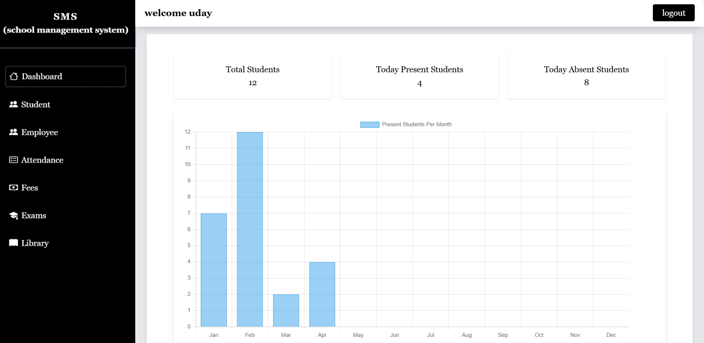

# 🏫 School Management System

✨ Showcasing My Skills • Projects • Journey ✨  

---

## 📌 Overview

The School Management System (SMS) is a modern web-based application developed to automate and manage school operations efficiently. It centralizes student, teacher, and administrative data into a single platform, reducing manual work and improving accuracy.

With an intuitive interface and organized structure, the system enables seamless management of attendance, examinations, and academic records, making school administration faster, smarter, and more reliable.

---

## 🚀 Features
 
✨ Clean and modern UI  
✨ Smooth navigation experience  
✨ Well-structured sections for better accessibility  

---

## 🛠️ Technologies Used

| Technology | Purpose |
|-----------|--------|
| HTML | Structure |
| Tailwind CSS | Styling |
| JavaScript | Interactivity |
| PHP | Backend |
| MySql | Database |

---

## 📂 Sections Included

- 📊 **Dashboard**  
  Overview of system activities with key insights and quick access to important data.

- 🎓 **Student Management**  
  Add, update, and manage student records efficiently.

- 👨‍🏫 **Employee Management**  
  Manage teacher and staff information in a structured way.

- 📅 **Attendance System**  
  Track and maintain daily attendance of students and staff.

- 💳 **Fees Management**  
  Handle fee collection, records, and payment tracking.

- 📝 **Examination System**  
  Manage exams, marks, and generate results.

- 📚 **Library Management**  
  Maintain book records, issue/return system, and library data.

---

## 🎯 Purpose

The main goal of this portfolio is to **present my technical skills and projects to recruiters** and showcase my ability to create real-world web applications.

---

## 📸 Preview

## 🎥 Demo Preview

> Click the image below to watch the full demo

---

## 📬 Contact

If you would like to connect with me:

- ✉️ Email: udaykumarraj2058@gmail.com  
- 🌐 Portfolio: https://udaybscitstudent.github.io/myinfo/  
- 🔗 LinkedIn: https://linkedin.com/in/uday-kumar-bb7746281  

---

## 🙌 Thank You

Thank you for visiting my portfolio!  
If you like it, feel free to ⭐ the repository.

---